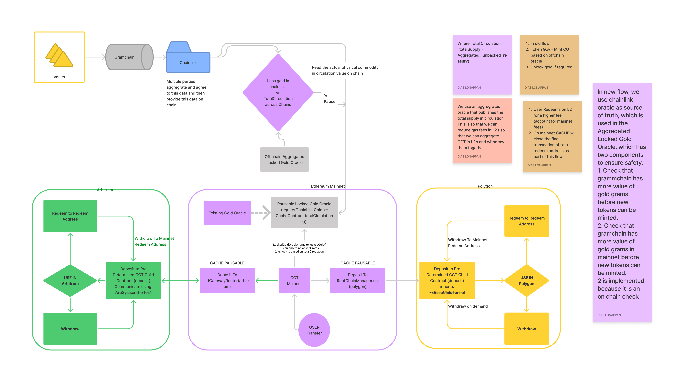

## Introduction
This repo is meant for the cross chain child contracts for CGT. Ethereum layer 2's and other chain information will be hosted in this repository, with smart contracts and tests in each chain hosted in their respectively named folders.

Token -> RootTunnel<BaseRootTunnel> -> FxRoot -> StateSender -> Checkpoints(Merrkle Tree, Heimdall nodes) -> FxChild -> RootChildContract -> ChildToken (Mints)

## Design philosophies

1. Keep it simple
1. Be able to have our own token with the fees on transfer model on other chains
1. We should not do anything that generates fees for no reason
2. We should not compromise usability for saving gas fees

## Workflow

We deploy bridges and enable feature flags to allow us to quickly deploy faster. The planned phases are as follows:

1. For now we will first just deploy, keep redemptions only on mainnet using a simple no mint no redeem address function on polygon.
2. feature flag- Enable redemptions on that chain, the chain has a local redeem and unbacked treasury address, only cache can withdraw back to the mainnet from this address.

Upon each redemptions event an offchain aggregator listens and computes the data and has the ability to use token governor to pause the oracle in case there is a discrepancy between
the chainlink gramchain feed and aggregated total circulation.
We lazy transfer from the unbacked in each local chain to the master chain when there is enough tokens in each chain to make the costs of bridge transfer make sense.

An offchain adapter that aggregates the oracle data for total circulation is used as illustrated in the following diagram:

Here we use chainlink oracle is used as the main oracle that gives us the data of how much tokens are available in the different vaults. We augment this by aggregating data from different chains 

Potential Issue:
Total circulation on mainnet on the CGT contract will not add up immediately, but will reach eventual consistency. We need to make it sufficiently clear on chain to not use the total circulation as a source of truth for applications that require immediate information to this. For eg. on the cache site we can show the aggregated oracle data and the chainlink feed, both of which will always be correct else the minting and unlock function will be paused.

## Polygon Cross chain 
We derive our contracts from FX-Portal repo, we create a simplified CGT contract and then deploy that as the CHILD contract with required FX extensions

for FxERC20ChildTunnel -> _tokenTemplate -> derived simplified CGT
for FxERC20RootTunnel -> _fxERC20Token -> derived simplified CGT

RootToken
https://goerli.etherscan.io/token/0x1542ac6e42940476c729680ff147e0cedcfcfcf2

Successfully verified contract FxCacheRootTunnel on Etherscan.
https://goerli.etherscan.io/address/0x61FFeAC0E2467e58173FfD15c0F993F890f989f6#code

Successfully verified contract FxERC20ChildTunnel on Etherscan.
https://mumbai.polygonscan.com/address/0x617d6f361AF9314E31B6675f174a2321abE929AE#cod

Successfully verified contract CacheGoldChild on Etherscan.
https://mumbai.polygonscan.com/address/0x5d20692Be3324110E4D258D4ec0d129Dc39040E5#code

Testnet Testing

1. Get some goerli eth https://goerli-faucet.mudit.blog/
2. Get some test CGT -> Send address to CACHE team
3. Approve transfer of test CGT 
4. https://goerli.etherscan.io/token/0x1542ac6e42940476c729680ff147e0cedcfcfcf2
5. Call approve where spender is 0x61FFeAC0E2467e58173FfD15c0F993F890f989f6 and amount has 8 decimals
6. Goto https://goerli.etherscan.io/address/0x61FFeAC0E2467e58173FfD15c0F993F890f989f6#writeContract
7. call `deposit` where
rootToken (address) - "0x1542ac6e42940476c729680ff147e0cedcfcfcf2"
childToken (address) - "0x5d20692Be3324110E4D258D4ec0d129Dc39040E5"
user (address) - "The address that should receive tokens on Mumbai"
amount (uint256) - Amount to transfer 8 decimals
data (bytes) - "0x00"
8. After 15 minutes/20 minutes verify your balance on polygon scan - 
https://mumbai.polygonscan.com/address/0x5d20692Be3324110E4D258D4ec0d129Dc39040E5#readContract